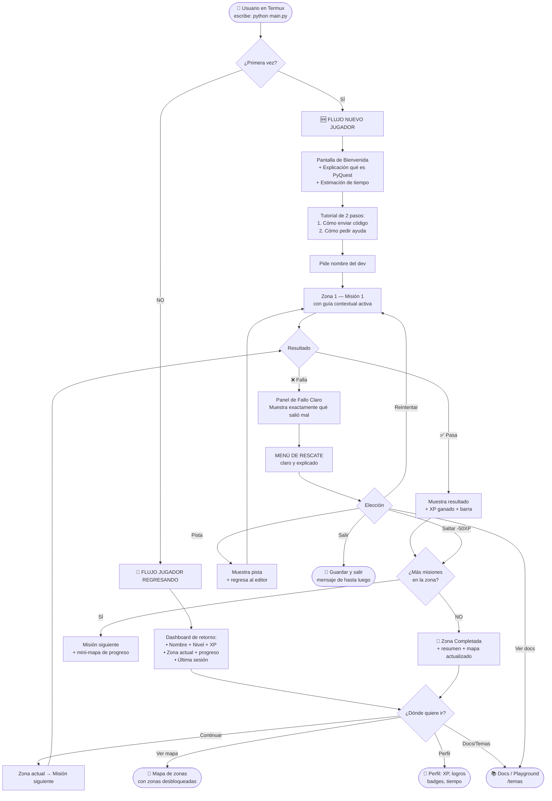

# 🗺️ PyQuest — Plan de Mejora de UX e Interacción

## Diagnóstico: Problemas Actuales

Analizando el código actual de `main.py` y `renderer.py`, se identifican estos problemas críticos:

| # | Problema | Impacto |
|---|----------|---------|
| 1 | **Primera pantalla vacía**: Solo pide el nombre y lanza la Zona 1 sin contexto | Alto |
| 2 | **Sin onboarding**: El usuario no sabe qué es PyQuest antes de empezar | Alto |
| 3 | **Loop de confusión en fallo**: Al fallar una misión, las opciones `[R]eintentar [H]int [S]kip [Q]uit` aparecen sin explicación | Alto |
| 4 | **Comandos ocultos**: Los `/comando` solo se ven en `/ayuda`, que nadie sabe que existe | Medio |
| 5 | **Contexto perdido**: No hay orientación de "¿en qué zona estás y cuánto falta?" al regresar | Medio |
| 6 | **Sin salida de emergencia clara**: Un usuario nuevo en Termux no sabe cómo salir limpiamente | Medio |
| 7 | **Sin indicador de qué hacer después de enviar código**: El cursor queda esperando sin instrucción clara | Alto |

---

## 🧭 Mapa de Casos de Uso — User Journey Completo



---

## 📋 Plan de Implementación Priorizado

### FASE 1 — Onboarding (Primera Vez) 🔴 Alta Prioridad

**Archivo a modificar: `engine/renderer.py` + `main.py`**

#### 1.1 Nueva pantalla de bienvenida para nuevos usuarios

Reemplazar el actual `show_title_screen` (que solo pide nombre) con un flujo de bienvenida real:

```python
# En engine/renderer.py — nueva función
def show_welcome_new_player():
    """Mostrar solo si es la primera vez (state.completed_missions == [])"""
    console.clear()
    # Logo PyQuest (existente)
    # + Panel explicativo de QUÉ ES el juego
    # + Estimación: "Cada zona toma ~10 minutos"
    # + Instrucción básica: "Escribes código Python → Enter → el juego lo evalúa"
    # + "Comandos siempre disponibles: /ayuda /mapa /salir"
```

**Cambio en `main.py` línea 327-329:**
```diff
  state = GameState.load()
- show_title_screen(state)
+ show_title_screen(state)
+ if not state.completed_missions:        # ← primera vez
+     show_welcome_new_player()
+     show_quick_tutorial()               # ← tutorial de 2 pasos
  state.save()
```

---

#### 1.2 Tutorial de 2 pasos (mini-onboarding)

Un mini-tutorial interactivo que el usuario **hace**, no solo lee:

```
📖 Paso 1 de 2: Enviar código
═══════════════════════════════
  Escribe esto y presiona Enter:
  >>> print("hola")
  
  [Ctrl+D para enviar en Termux]

📖 Paso 2 de 2: Pedir ayuda
═══════════════════════════════
  Si te atascas, escribe:
  /ayuda  → lista de comandos
  /docs   → documentación Python
  /mapa   → ver tu progreso
```

---

### FASE 2 — Dashboard de Retorno 🔴 Alta Prioridad

**Archivo: `engine/renderer.py` + `main.py`**

Cuando el usuario regresa (ya tiene misiones completadas), en lugar de lanzar directo a la zona, mostrar:

```
╔══════════════════════════════════════════╗
║  👋 Bienvenido de vuelta, Yeiid          ║
║  Nivel 3 · Dev · 245/300 XP             ║
╠══════════════════════════════════════════╣
║  📍 Zona actual: Variables y Tipos       ║
║     Progreso: 3 de 5 misiones ████░ 60% ║
║  ⏰ Última sesión: hace 2 días          ║
╚══════════════════════════════════════════╝

  [C] Continuar donde lo dejaste
  [M] Ver mapa de zonas
  [P] Ver perfil
  [D] Ir a documentación
  [S] Salir
```

**Cambio en `main.py` línea 333 (inicio del while True):**
```diff
+ if state.total_missions > 0 and not shown_dashboard:
+     show_return_dashboard(state)       # ← nuevo
+     shown_dashboard = True
  while True:
      zone_info = get_zone(state.unlocked_zones)
```

---

### FASE 3 — Panel de Fallo Claro (Eliminar el Loop de Confusión) 🔴 Alta Prioridad

**Archivo: `main.py` función `handle_mission_fail()`**

El problema actual: cuando fallas, aparece `[R]eintentar [H]int [S]kip(-50xp) [D]ocs [Q]uit` en una sola línea sin contexto.

**Propuesta: panel contextual de rescate**

```python
def handle_mission_fail(state, mission, mission_key, act):
    # Mostrar panel de diagnóstico antes del menú
    console.print(Panel(
        "[bold red]✗ Tu código no pasó las pruebas[/]\n\n"
        "[white]¿Qué puedes hacer?[/]\n"
        "  [yellow][R][/] Reintentar  — vuelve a escribir tu solución\n"
        "  [cyan][H][/] Pedir pista  — una ayuda sin spoilers\n"  
        "  [blue][D][/] Ver docs     — documentación de Python\n"
        "  [dim][S][/] Saltar       — avanza (pierdes 50 XP)\n"
        "  [dim][Q][/] Salir        — guardar y cerrar\n",
        title="🔧 Taller de Debug",
        border_style="red",
        box=box.ROUNDED,
    ))
    choice = console.input("[bold]Tu elección (R/H/D/S/Q): [/]").lower()
```

---

### FASE 4 — Barra de Orientación Persistente 🟡 Media Prioridad

**Archivo: `engine/renderer.py`**

Agregar una línea de estado contextual antes de cada misión que recuerde al usuario dónde está:

```
[Zona 2/12] [Misión 3/5] [Lv.3 • 245 XP] [💡 3 pistas] [/ayuda para comandos]
```

Esto se añade al inicio de `render_mission()`:

```python
def render_orientation_bar(zone_id, zone_total, mission_num, mission_total, state, hints_left):
    bar = (
        f"[dim]│ Zona {zone_id}/{zone_total} "
        f"│ Misión {mission_num}/{mission_total} "
        f"│ Lv.{state.level} · {state.xp}XP "
        f"│ 💡{hints_left} │ /ayuda │[/]"
    )
    console.rule(bar, style="dim")
```

---

### FASE 5 — Hint del Día al Regresar 🟢 Baja Prioridad

**Archivo: `main.py`**

Al iniciar sesión, mostrar un tip rotativo aleatorio sobre Python o sobre el juego:

```python
DAILY_TIPS = [
    "💡 Usa /playground para experimentar con Python libremente",
    "💡 /docs lista → ver listas en Python",
    "💡 Si te atascas, /ayuda muestra todos los comandos",
    "💡 Cada zona tiene un objeto coleccionable oculto 🏆",
]
```

---

## 🏗️ Resumen de Archivos a Modificar

| Archivo | Cambios | Fase |
|---------|---------|------|
| `engine/renderer.py` | `show_welcome_new_player()`, `show_return_dashboard()`, `render_orientation_bar()`, mejora de `handle_mission_fail()` | 1, 2, 3, 4 |
| `main.py` | Lógica de detección primera vez, dashboard de retorno, integración de orientation bar, daily tip | 1, 2, 4, 5 |
| `engine/state.py` | Agregar campo `is_tutorial_done: bool` | 1 |

---

## ✅ Prioridades Recomendadas

```
🔴 CRÍTICO (esta semana)
  ├─ Fase 1: Onboarding nueva pantalla + tutorial 2 pasos
  ├─ Fase 2: Dashboard de retorno
  └─ Fase 3: Panel de fallo contextual

🟡 IMPORTANTE (próxima semana)  
  └─ Fase 4: Barra de orientación persistente

🟢 NICE TO HAVE (después)
  └─ Fase 5: Daily tip
```

---

## 🤔 Decisiones que Necesito Saber

1. **¿Quieres que implemente todo en un solo PR o fase por fase?**
2. **¿El tutorial de 2 pasos debe ser interactivo** (el usuario realmente escribe `print("hola")`) **o solo informativo** (lee y presiona Enter)?
3. **¿El dashboard de retorno debe ofrecer menú de elección** (continuar/mapa/perfil) **o siempre continuar automáticamente** al cabo de 3 segundos?
